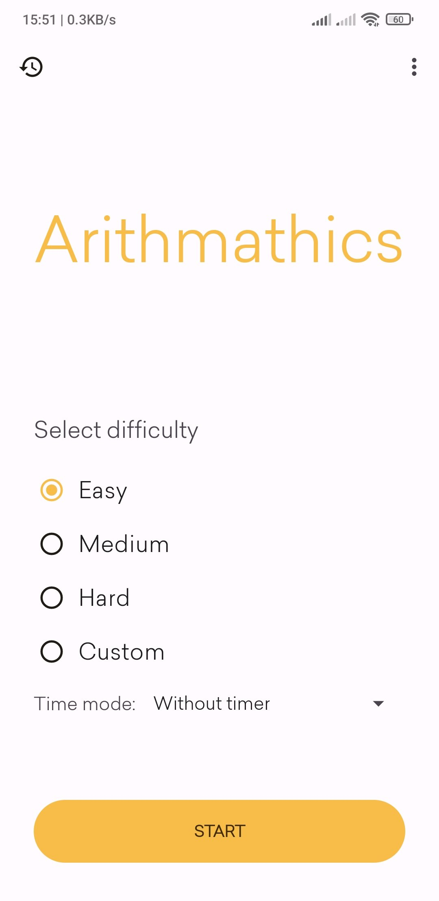
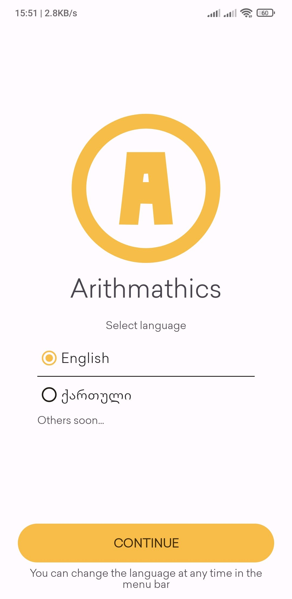
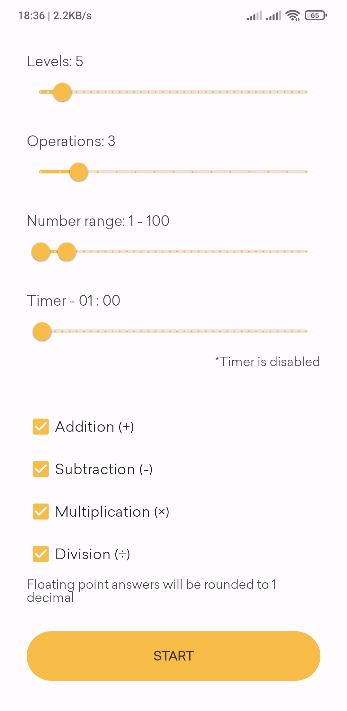
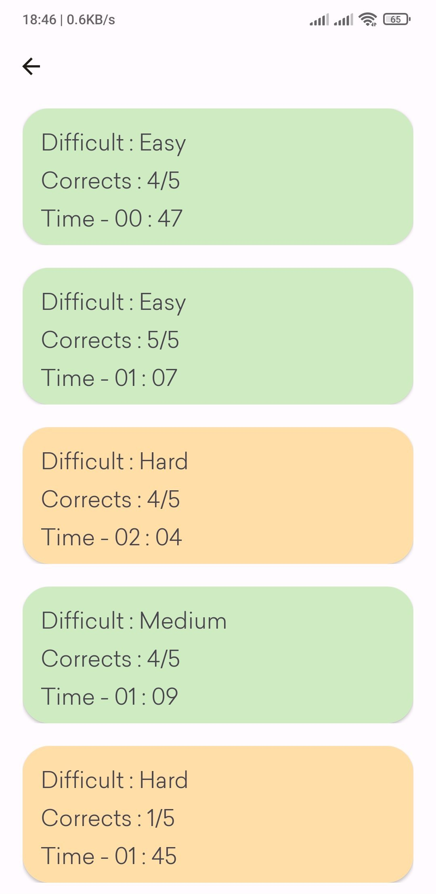
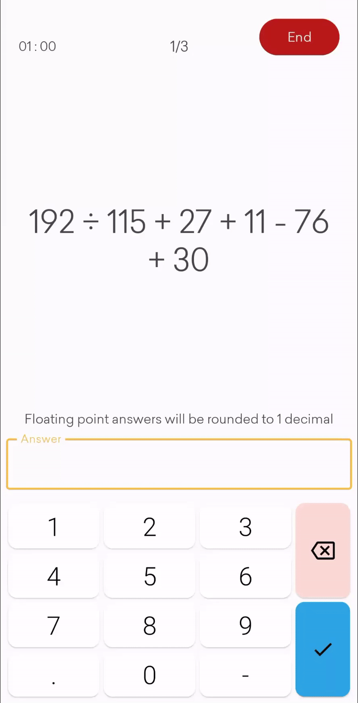
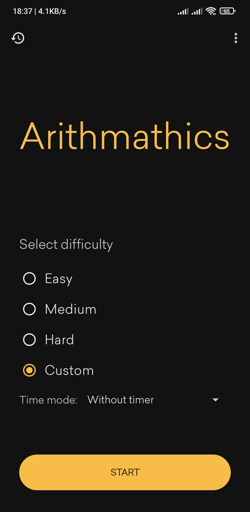
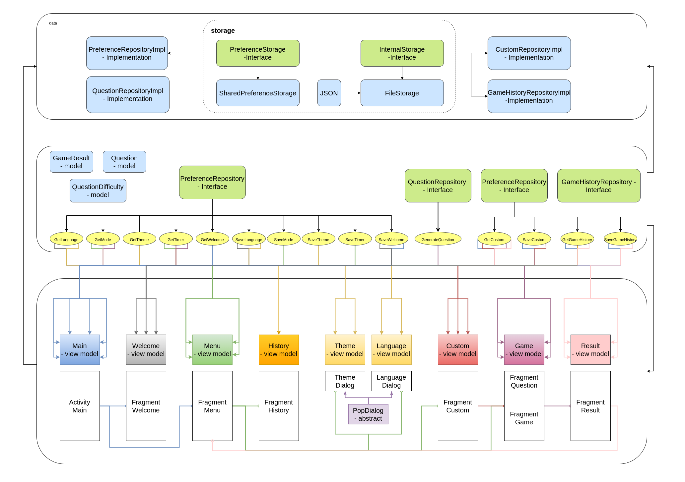

<h1 align="center">
  <a href="https://github.com/hexley21/ArithMathics">
    <!-- Please provide path to your logo here -->
    
  </a>
</h1>

<div align="center">
  Arithmathics
  <br />
  <strong>Improve your arithmetic skills by practicing</strong>

  <a href="#about"><strong>Explore the screenshots »</strong></a>
  <br />
  <br />
  <a href="https://github.com/hexley21/ArithMathics/issues/new?assignees=&labels=bug&template=01_BUG_REPORT.md&title=bug%3A+">Report a Bug</a>
  ·
  <a href="https://github.com/hexley21/ArithMathics/issues/new?assignees=&labels=enhancement&template=02_FEATURE_REQUEST.md&title=feat%3A+">Request a Feature</a>
  .
  <a href="https://github.com/hexley21/ArithMathics/issues/new?assignees=&labels=question&template=04_SUPPORT_QUESTION.md&title=support%3A+">Ask a Question</a>
</div>

<div align="center">
<br />

[](LICENSE)
[](https://github.com/hexley21/ArithMath/issues?q=is%3Aissue+is%3Aopen+label%3A%22help+wanted%22)

</div>

<details open="open">
<summary>Table of Contents</summary>

- [About](#about)
  - [Built With](#built-with)
- [Download code](#download-code)
  - [Prerequisites](#prerequisites)
  - [Android studio](#android-studio)
  - [Visual studio code](#visual-studio-code)
- [Roadmap](#roadmap)
- [Support](#support)
- [Project assistance](#project-assistance)
- [Contributing](#contributing)
- [Authors & contributors](#authors--contributors)
- [License](#license)
- [Acknowledgements](#acknowledgements)

</details>

---

## About

> Arithmathics is a quiz game, where you solve
> randomly generated airthmetic tasks of different difficulty
> in order to improve your arithmetic skills

<details>
<summary>Screenshots</summary>
<br>

|                               Welcome Page                               |                               Menu Page                                   |
| :-------------------------------------------------------------------: | :--------------------------------------------------------------------: |
|  | |


|                               Custom Difficulty Page                               |                               Game History Page                                   |
| :-------------------------------------------------------------------: | :--------------------------------------------------------------------: |
|  | |

|                               Gameplay                               |                               Dark Theme                                   |
| :-------------------------------------------------------------------: | :--------------------------------------------------------------------: |
|  | |

</details>

### Built With

> Arithmathics is written in Kotlin language and
> is build by 
> <a href="https://medium.com/android-dev-hacks/detailed-guide-on-android-clean-architecture-9eab262a9011">clean architecture</a>,
> which contains MVVM pattern
<details>
<summary>Draw.io diagram</summary>

</details>
<br>

## Download code
Repository URL
```
https://github.com/hexley21/ArithMathics.git
```
### Prerequisites

> - <a href="https://developer.android.com/studio">Android Studio</a>
> - or
> - <a href="https://code.visualstudio.com/">Visual studio Code</a>
> - <a href="https://git-scm.com/downloads">Git</a>


### Android studio

at Welcome Page:
> Get from VCS -> URL. paste repository url -> Clone

at Workspace:

> File -> New -> Project from Version Control -> URL. paste repository url -> Clone

### Visual studio code

> - install git
> - open Visual studio Code and select workspace folder
> - open terminal with `ctrl + shift + ~ `
> - type: `git clone https://github.com/hexley21/ArithMathics.git`

<br>

## Roadmap

See the [open issues](https://github.com/hexley21/ArithMathics/issues) for a list of proposed features (and known issues).

- [Top Feature Requests](https://github.com/hexley21/ArithMathics/issues?q=label%3Aenhancement+is%3Aopen+sort%3Areactions-%2B1-desc) (Add your votes using the 👍 reaction)
- [Top Bugs](https://github.com/hexley21/ArithMathics/issues?q=is%3Aissue+is%3Aopen+label%3Abug+sort%3Areactions-%2B1-desc) (Add your votes using the 👍 reaction)
- [Newest Bugs](https://github.com/hexley21/ArithMathics/issues?q=is%3Aopen+is%3Aissue+label%3Abug)

## Support


Reach out to the maintainer at one of the following places:

- [GitHub issues](https://github.com/hexley21/ArithMathics/issues/new?assignees=&labels=question&template=04_SUPPORT_QUESTION.md&title=support%3A+)
- Contact options listed on [this GitHub profile](https://github.com/hexley21)

## Project assistance

If you want to say **thank you** or/and support active development of Arithmathics:

- Add a [GitHub Star](https://github.com/hexley21/ArithMathics) to the project.
- Write interesting articles about the project on [Dev.to](https://dev.to/), [Medium](https://medium.com/) or your personal blog.

Together, we can make Arithmathics **better**!

## Contributing

First off, thanks for taking the time to contribute! Contributions are what make the open-source community such an amazing place to learn, inspire, and create. Any contributions you make will benefit everybody else and are **greatly appreciated**.


Please read [our contribution guidelines](docs/CONTRIBUTING.md), and thank you for being involved!

## Authors & contributors

The original setup of this repository is by [Avtandil Kupreishvili](https://github.com/hexley21).

For a full list of all authors and contributors, see [the contributors page](https://github.com/hexley21/ArithMathics/contributors).

## License

This project is licensed under the **Apache Software License 2.0**.

See [LICENSE](LICENSE) for more information.

## Acknowledgements

This game would not be able to exist without this dependencies:
> - <a href="https://github.com/airbnb/paris">Airbnb - Paris</a> - Apply styles to Android views programmatically
> - <a href="https://github.com/google/dagger">Dagger Hilt</a> - Dependency injector for Android and Java.
> - <a href="https://github.com/google/gson">Gson</a> - Convert Java Objects into JSON and back
> - <a href="https://www.objecthunter.net/exp4j/">exp4j</a> - Math parser libray

Arithmathics used these sources for design:
> - Font - <a href="https://www.contractica.ge/">TBC Contractica</a>
> - Icons - <a href="https://fonts.google.com/icons">Google Material icons</a>
